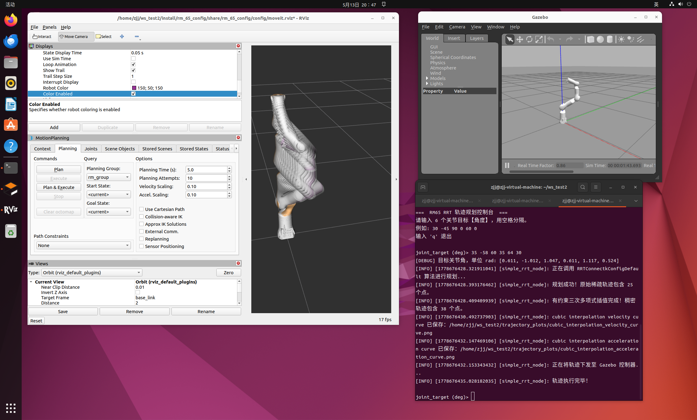
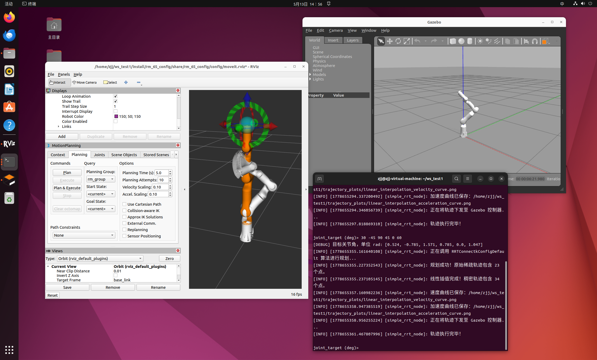
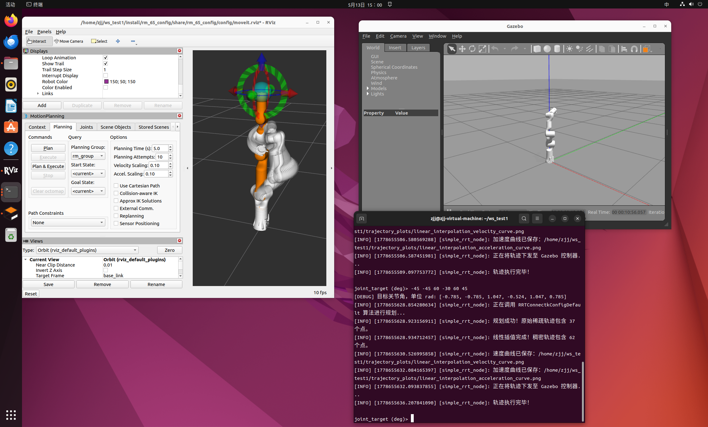
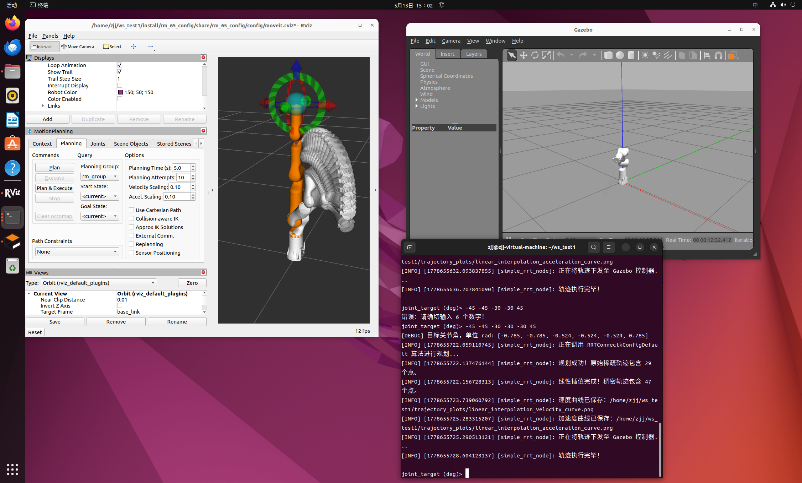

# 基于 ROS2 的六自由度机械臂轨迹规划研究

> Simulation Research on Trajectory Planning of 6-DOF Manipulator Based on ROS

**作者**: zjj &nbsp;|&nbsp; **时间**: 2026年5月 &nbsp;|&nbsp; **毕设**

## 项目简介

本项目面向 RM65 六自由度协作机械臂，基于 ROS2 Humble 搭建了一套完整的轨迹规划仿真系统。系统通过 MoveIt2 框架调用 RRTConnect 算法获取稀疏路径，设计独立调度节点对轨迹进行线性插值 / 三次多项式插值优化，实现 MoveIt2 规划层与 Gazebo 仿真执行层的解耦。仿真结果表明，经调度节点处理后的机械臂轨迹平滑连续，能稳定到达目标位置。

## 系统架构

```
用户输入 (6 个关节目标角度)
    │
    ▼
┌──────────────────────────┐
│  rm_65_rrt_console       │  ← RRT 控制台节点 (Python)
│  - 调用 RRTConnect 规划   │
│  - 线性/三次多项式插值     │
│  - 速度/加速度曲线绘制     │
└──────────┬───────────────┘
           │ Action 通信
           ▼
┌──────────────────────────┐
│  MoveIt2 (move_group)    │  ← 运动规划框架
│  - 运动学求解 (KDL)       │
│  - 碰撞检测               │
│  - 轨迹执行               │
└──────────┬───────────────┘
           │ ros2_control
           ▼
┌──────────────────────────┐
│  Gazebo 仿真             │  ← 物理仿真引擎
│  - RM65 机器人模型        │
│  - 关节轨迹跟踪           │
└──────────────────────────┘
```

## 功能包说明

| 功能包 | 类型 | 说明 |
|--------|------|------|
| `rm_description` | ament_cmake | RM65 机械臂 URDF/Xacro 模型、STL 网格、RViz 可视化启动 |
| `rm_65_config` | ament_cmake | MoveIt2 配置包（运动学、关节限位、控制器、SRDF） |
| `rm_gazebo` | ament_cmake | Gazebo 仿真启动（含 ros2_control、三种末端变体） |
| `rm_65_rrt_console` | ament_python | 交互式 RRT 规划控制台节点（线性插值 / 三次样条） |

## 环境依赖

- **操作系统**: Ubuntu 22.04
- **ROS2 发行版**: Humble
- **核心依赖**:
  - `moveit_ros_move_group` / `moveit_kinematics` / `moveit_planners`
  - `gazebo_ros` / `gazebo_ros2_control`
  - `controller_manager` / `joint_trajectory_controller`
  - `robot_state_publisher` / `rviz2` / `xacro`
  - `rclpy` / `moveit_msgs` / `control_msgs` / `trajectory_msgs`
  - `warehouse_ros_mongo`

## 环境准备

本项目依赖 ROS2 Humble 和 MoveIt2 源码编译环境，请按以下顺序完成安装：

### 1. 安装 ROS2 Humble（小鱼一键安装）

使用小鱼一键安装工具，一行命令完成 ROS2 安装：

```bash
wget http://fishros.com/install -O fishros && ./fishros
```

安装后 source 环境：

```bash
source /opt/ros/humble/setup.bash
```

### 2. 安装 MoveIt2（源码编译）

提供两种方式，根据网络环境选择：

#### 方式一：GitHub 源码编译（需要梯子）

```bash
mkdir -p ~/moveit2_ws/src
cd ~/moveit2_ws/src
git clone https://github.com/ros-planning/moveit2.git -b humble
vcs import < moveit2/moveit2.repos
cd ~/moveit2_ws
rosdep install -r --from-paths src --ignore-src --rosdistro humble -y
colcon build --symlink-install
source install/setup.bash
```

#### 方式二：国内镜像编译（无需梯子）

将 GitHub 地址替换为国内镜像源（如 ghproxy），其余步骤相同：

```bash
mkdir -p ~/moveit2_ws/src
cd ~/moveit2_ws/src
# 使用 ghproxy 镜像加速
git clone https://ghproxy.com/https://github.com/ros-planning/moveit2.git -b humble
cd moveit2
# 将 .repos 文件中的 github.com 替换为镜像地址
sed -i 's|https://github.com|https://ghproxy.com/https://github.com|g' moveit2.repos
vcs import < moveit2.repos
cd ~/moveit2_ws
rosdep install -r --from-paths src --ignore-src --rosdistro humble -y
colcon build --symlink-install
source install/setup.bash
```

### 3. 安装 Gazebo 与 ros2_control

```bash
sudo apt install ros-humble-gazebo-ros-pkgs ros-humble-gazebo-ros2-control ros-humble-ros2-control ros-humble-ros2-controllers
```

## 编译

```bash
cd <workspace_root>
colcon build --symlink-install
source install/setup.bash
```

## 控制节点准备（重要）

`rm_65_rrt_console` 包提供了两种轨迹插值算法实现，**使用前需二选一**：

| 文件 | 插值方式 | 特点 |
|------|----------|------|
| `rrt_console_node(liner).py` | 线性插值 | 对稀疏路径点等距插值，简单高效 |
| `rrt_console_node( cubic).py` | 三次多项式插值 | 带速度约束的三次样条，轨迹更平滑 |

`setup.py` 的入口点固定指向 `rrt_console_node.py`（不含括号后缀），因此需要将所选文件重命名：

```bash
# 选择线性插值版本
cd src/rm_65_rrt_console/rm_65_rrt_console/
cp "rrt_console_node(liner).py" rrt_console_node.py

# 或选择三次多项式插值版本
cp "rrt_console_node( cubic).py" rrt_console_node.py
```

> 括号在 Python 模块名中为非法字符，无法被 import。去掉后缀后 `setup.py` 的 entry_point 才能正确解析模块。

## 运行

需要三个终端，按顺序启动：

**终端 1 — 启动 Gazebo 仿真**

```bash
source install/setup.bash
ros2 launch rm_gazebo gazebo_65_demo.launch.py
```

**终端 2 — 启动 MoveIt2 + RViz**

```bash
source install/setup.bash
ros2 launch rm_65_config gazebo_moveit_demo.launch.py
```

**终端 3 — 启动 RRT 控制台**

控制台节点需要交互式输入关节角度，优先使用 `ros2 run`。若 launch 可用也可使用 launch：

```bash
source install/setup.bash

# 方式一 (推荐): ros2 run
ros2 run rm_65_rrt_console joint_rrt_console --ros-args -p use_sim_time:=true

# 方式二 (备选): ros2 launch (在部分环境下 stdin 转发可能失效)
ros2 launch rm_65_rrt_console rrt_console.launch.py
```

> **为什么 launch 可能不可用**: `ros2 launch` 即使配置了 `emulate_tty`，对 `input()` 的 stdin 转发也不总是可靠，导致无法输入关节角度。`ros2 run` 直接绑定终端 stdin/stdout，确保交互式输入正常工作。

在终端 3 中按提示输入 6 个关节目标角度（单位：度），例如：

```
30 -45 90 0 60 0
```

系统将自动完成 RRTConnect 路径规划 → 轨迹插值优化 → 速度/加速度曲线绘制 → Gazebo 执行。

## 效果展示

### Gazebo 仿真环境


### 三次多项式仿真结果



### 关节连续性验证








## 仅可视化（无仿真）

```bash
ros2 launch rm_description display_robot_launch.py
```

## 轨迹插值算法

本项目设计了独立的轨迹调度节点，支持两种插值方式：

1. **线性插值** — 对应 `rrt_console_node(liner).py`：对稀疏路径点进行等距线性插值，计算简单，效率高。
2. **三次多项式插值** — 对应 `rrt_console_node( cubic).py`：采用带速度约束的三次样条插值，生成的轨迹更平滑连续，速度和加速度曲线无突变。

使用时只需将选定的文件重命名为 `rrt_console_node.py`（去掉括号后缀），详见上方「控制节点准备」一节。

## 末端变体

通过 Xacro 参数 `link6_type` 支持三种末端执行器配置：

- `Link6`（标准型）
- `Link6_6f`（6 自由度末端）
- `Link6_6fb`（带平衡块的 6 自由度末端）

切换方式：修改启动文件中的 `link6_type` 参数。

## 参考文献

### 官方文档

1. [ROS2 Documentation](https://docs.ros.org/en/humble/index.html) — ROS2 Humble 官方文档
2. [MoveIt2 Documentation](https://moveit.picknik.ai/humble/index.html) — MoveIt2 运动规划框架文档
3. [ros2_control Documentation](https://control.ros.org/humble/index.html) — ros2_control 控制框架文档
4. [Gazebo Documentation](https://gazebosim.com/docs) — Gazebo 仿真平台文档
5. [OMPL Documentation](https://ompl.kavrakilab.org/) — 开源运动规划库（含 RRTConnect 算法）
6. [RViz2 Documentation](https://docs.ros.org/en/humble/Tutorials/Intermediate/RViz/RViz-User-Guide/RViz-User-Guide.html) — ROS2 3D 可视化工具文档
7. [RealManRobot/ros2_rm_robot](https://github.com/RealManRobot/ros2_rm_robot) — 睿尔曼 RM65 机械臂 ROS2 官方驱动与仿真文档


